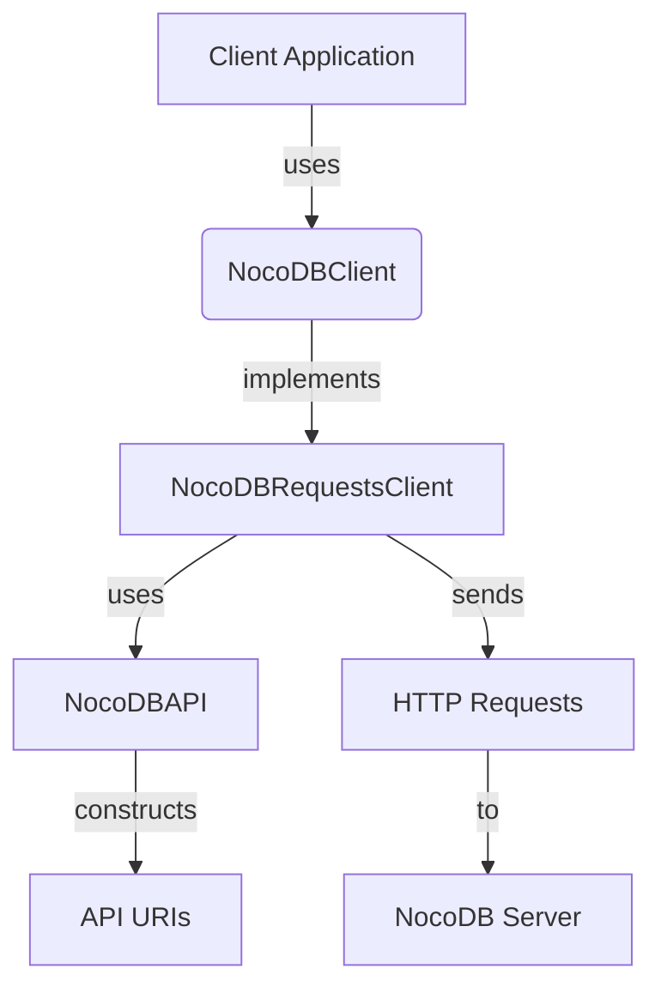

<div align="center">

# 🚀 NocoDB Python Client

[](https://pypi.org/project/nocodb/)
[](LICENSE)
[](https://pypi.org/project/nocodb/)

**Note: This is a fork of [python-nocodb](https://github.com/elchicodepython/python-nocodb) with extended functionality.**


NocoDB is a great Airtable alternative. This client allows python developers
to use NocoDB API in a simple way.

</div>

## 📌 Table of Contents

- [🚀 NocoDB Python Client](#-nocodb-python-client)
  - [📌 Table of Contents](#-table-of-contents)
  - [📥 Installation](#-installation)
  - [🔧 Usage](#-usage)
    - [🔑 Client configuration](#-client-configuration)
    - [📊 Project creation](#-project-creation)
    - [Project selection](#project-selection)
    - [Table rows operations](#table-rows-operations)
    - [📋 Table Operations](#-table-operations)
    - [🔢 Table Column Operations](#-table-column-operations)
    - [🔍 View Filter Operations](#-view-filter-operations)
    - [👥 Project Users Management](#-project-users-management)
    - [🔎 Available filters](#-available-filters)
      - [Combining filters using Logical operations](#combining-filters-using-logical-operations)
    - [Using custom filters](#using-custom-filters)
  - [Author notes](#author-notes)
  - [📋 Version Information](#-version-information)
    - [✨ Features Overview](#-features-overview)
    - [📈 Key Benefits](#-key-benefits)
    - [🏗️ Architecture](#️-architecture)
  - [👨‍💻 Contributors](#-contributors)
    - [Original Authors](#original-authors)
    - [Fork Maintainer](#fork-maintainer)

## 📥 Installation

Since this is a fork with additional functionality, install directly from the GitHub repository:

```bash
pip install git+https://github.com/DeepCognition/python-nocodb.git
```

<details>
<summary>Development Installation</summary>

```bash
git clone https://github.com/DeepCognition/python-nocodb.git
cd python-nocodb
pip install -e .
```

</details>

<details>
<summary>Original Package</summary>

If you want the original package without the enhancements:

```bash
pip install nocodb
```

</details>

## 🔧 Usage

### 🔑 Client configuration
```python
from nocodb.nocodb import NocoDBProject, APIToken, JWTAuthToken
from nocodb.filters import LikeFilter, EqFilter, And
from nocodb.infra.requests_client import NocoDBRequestsClient


# Usage with API Token
client = NocoDBRequestsClient(
        # Your API Token retrieved from NocoDB conf
        APIToken("YOUR-API-TOKEN"),
        # Your nocodb root path
        "http://localhost:8080"
)

# Usage with JWT Token
client = NocoDBRequestsClient(
        # Your API Token retrieved from NocoDB conf
        JWTAuthToken("your.jwt.token"),
        # Your nocodb root path
        "http://localhost:8080"
)
```

### 📊 Project creation
```python
# Example with default database
project_body = {"title": "My new project"}

# Example with Postgresql
project_body = {
    "title": "MyProject",
    "bases": [
        {
            "type": "pg",
            "config": {
                "client": "pg",
                "connection": {
                    "host": "localhost",
                    "port": "5432",
                    "user": "postgres",
                    "password": "postgres",
                    "database": "postgres"
                },
                "searchPath": [
                    "public"
                ]
            },
            "inflection_column": "camelize",
            "inflection_table": "camelize"
        }
    ],
    "external": True
}

project = client.project_create(body=project_body)
```

### Project selection
```python
# Be very carefull with org, project_name and table names
# weird errors from nocodb can arrive if they are wrong
# example: id is not defined...
# probably they will fix that in a future release.
project = NocoDBProject(
        "noco", # org name. noco by default
        "myproject" # project name. Case sensitive!!
)

```

### Table rows operations
```python
table_name = "tablename"

# Retrieve a page of rows from a table
table_rows = client.table_row_list(project, table_name)

# Retrieve the first 1000 rows
table_rows = client.table_row_list(project, table_name, params={'limit': 1000})

# Skip 100 rows
table_rows = client.table_row_list(project, table_name, params={'offset': 100})
```

⚠️ Seems that we can't retrieve more than 1000 rows at the same time but we can paginate
 to retrieve all the rows from a table

Pagination example

```python

first_100_rows = client.table_row_list(project, table_name, params={'limit': 100})
next_100_rows = client.table_row_list(project, table_name, params={'limit': 100, 'offset': 100})
next_100_rows = client.table_row_list(project, table_name, params={'limit': 100, 'offset': 200})
```

More row operations

```python
# Filter the query
table_rows = client.table_row_list(project, table_name, LikeFilter("name", "%sam%"))
table_rows = client.table_row_list(project, table_name, And(LikeFilter("name", "%sam%"), EqFilter("age", 26)))
table_rows = client.table_row_list(project, table_name, filter_obj=EqFilter("Id", 100))

# Filter and count rows
count = client.table_count(project, table_name, filter_obj=EqFilter("Id", 100))

# Find one row
table_row = client.table_find_one(project, table_name, filter_obj=EqFilter("Id", 100), params={"sort": "-created_at"})

# Retrieve a single row
row_id = 10
row = client.table_row_detail(project, table_name, row_id)

# Create a new row
row_info = {
    "name": "my thoughts",
    "content": "i'm going to buy samuel a beer 🍻 because I 💚 this module",
    "mood": ":)"
}
client.table_row_create(project, table_name, row_info)

# Update a row
row_id = 2
row_info = {
    "content": "i'm going to buy samuel a new car 🚙 because I 💚 this module",
}
client.table_row_update(project, table_name, row_id, row_info)

# Bulk insert multiple rows
rows_to_insert = [
    {"name": "Alice", "age": 30},
    {"name": "Bob", "age": 28},
]
client.table_row_bulk_insert(project, table_name, rows_to_insert)

# Delete a row (only if you've already bought me a beer)
client.table_row_delete(project, table_name, row_id)
```

### 📋 Table Operations

```python
# List all tables in a project
tables = client.table_list(project)

# Read table metadata
table_id = "table_id_from_table_list"
table_metadata = client.table_read(table_id)

# Get detailed table info
table_info = client.table_info(table_id)

# Create a new table
table_body = {
    "table_name": "NewTableName",
    "columns": [
        {
            "title": "Title",
            "column_name": "title",
            "dt": "varchar"
        },
        {
            "title": "Description",
            "column_name": "description",
            "dt": "text"
        }
    ]
}
client.table_create(project, table_body)

# Update a table
table_update_body = {
    "table_name": "UpdatedTableName"
}
client.table_update(table_id, table_update_body)

# Reorder a table
client.table_reorder(table_id, order=2)

# Delete a table
client.table_delete(table_id)
```

### 🔢 Table Column Operations

```python
# Create a new column in a table
column_body = {
    "title": "Rating",
    "column_name": "rating",
    "dt": "int"
}
client.table_column_create(table_id, column_body)

# Update a column
column_id = "column_id_from_table_info"
column_update_body = {
    "title": "Score"
}
client.table_column_update(column_id, column_update_body)

# Set a column as primary
client.table_column_set_primary(column_id)

# Delete a column
client.table_column_delete(column_id)
```

### 🔍 View Filter Operations

```python
# Create a filter for a view
view_id = "view_id_from_view_list"
filter_body = {
    "comparison_op": "eq",
    "value": "Active",
    "fk_column_id": column_id
}
client.view_filter_create(view_id, filter_body)
```

### 👥 Project Users Management

```python
# Get users for a project with pagination
users_page = client.project_users_list(
    project, 
    page=1, 
    page_size=25, 
    include_roles=True
)

# Get all users for a project (automatically handles pagination)
all_users = client.project_users_list_all(
    project, 
    include_roles=True
)
```

### 🔎 Available filters

- EqFilter
- EqualFilter (Alias of EqFilter)
- NotEqualFilter
- GreaterThanFilter
- GreaterOrEqualFilter
- LessThanFilter
- LessOrEqualFilter
- LikeFilter
- Or
- Not
- And

#### Combining filters using Logical operations

```python
from nocodb import filters

# Basic filters...
nick_filter = filters.EqFilter("nickname", "elchicodepython")
country_filter = filters.EqFilter("country", "es")
girlfriend_code = filters.EqFilter("gfcode", "404")
current_mood_code = filters.EqFilter("moodcode", "418")

# Combining filters using logical filters
or_filter = filters.Or(nick_filter, country_filter)
and_filter = filters.And(girlfriend_code, current_mood_code)

# Negating filters with a Not filter
not_me = filters.Not(filters.EqFilter("nickname", "elchicodepython"))

# You can also combine combinations
or_combined_filter = filters.Or(or_filter, and_filter)
and_combined_filter = filters.And(or_filter, and_filter)

```

### Using custom filters

Nocodb is evolving and new operators are coming with each release.

Most of the basic operations are inside this package but you could need some new
feature that could not be added yet.
For those filters you can build your own.

Example for basic filters:

```python
from nocodb.filters.factory import basic_filter_class_factory

BasicFilter = basic_filter_class_factory('=')
table_rows = client.table_row_list(project, table_name, BasicFilter('age', '16'))

```

You can find the updated list of all the available nocodb operators [here](https://docs.nocodb.com/developer-resources/rest-apis/#comparison-operators).

In some cases you might want to write your own filter string as described in the previous link.
For that cases you can use the less-semmantic RawFilter.

```python
from nocodb.filters.raw_filter import RawFilter

table_rows = client.table_row_list(project, table_name, RawFilter('(birthday,eq,exactDate,2023-06-01)'))
```

In some cases we might want to have a file with some custom raw filters already defined by us.
We can easily create custom raw filter classes using `raw_template_filter_class_factory`.

```python
from nocodb.filters.factory import raw_template_filter_class_factory

BirthdayDateFilter = raw_template_filter_class_factory('(birthday,eq,exactDate,{})')
ExactDateEqFilter = raw_template_filter_class_factory('({},eq,exactDate,{})')
ExactDateOpFilter = raw_template_filter_class_factory('({},{op},exactDate,{})')

table_rows = client.table_row_list(project, table_name, BirthdayDateFilter('2023-06-01'))
table_rows = client.table_row_list(project, table_name, ExactDateEqFilter('column', '2023-06-01'))
table_rows = client.table_row_list(project, table_name, ExactDateOpFilter('column', '2023-06-01', op='eq'))
```


Credits to @MitPitt for asking this feature.

## Author notes

I created this package to bootstrap some personal projects and I hope it
will help other developers from the python community. It's not completed but
it has what I needed: A full CRUD with some filters.

Feel free to add new capabilities by creating a new MR.

## 📋 Version Information

<div align="center">

### ✨ Features Overview

| Feature Category | Capabilities |
|-----------------|-------------|
| 📝 **Row Operations** | Create, Read, Update, Delete, Bulk Insert |
| 📊 **Table Management** | Create, List, Read, Update, Delete, Reorder |
| 🔢 **Column Management** | Create, Update, Delete, Set Primary |
| 👥 **User Management** | List with pagination, List all users |
| 🔍 **Filtering** | Multiple filter types, Custom filters, Combined conditions |
| 🔎 **Query Options** | Sorting, Pagination, Field selection |

</div>

<div align="center">

### 📈 Key Benefits

<table>
  <tr>
    <td align="center"><b>🚀 Efficient</b><br>Bulk operations support</td>
    <td align="center"><b>🛠️ Complete</b><br>Full CRUD functionality</td>
    <td align="center"><b>🔍 Flexible</b><br>Advanced filtering</td>
  </tr>
  <tr>
    <td align="center"><b>🧩 Extensible</b><br>Custom filter support</td>
    <td align="center"><b>👥 Collaborative</b><br>User management</td>
    <td align="center"><b>📊 Powerful</b><br>Table & column operations</td>
  </tr>
</table>

</div>

<div align="center">

### 🏗️ Architecture



</div>

## 👨‍💻 Contributors


### Original Authors
- Samuel López Saura @elchicodepython
- Ilya Sapunov @davert0
- Delena Malan @delenamalan
- Jan Scheiper @jangxx

### Fork Maintainer
- Santosh Ray - VP of Technology [@santoshray02](https://github.com/santoshray02) (DeepCognition)
  - Added bulk insert functionality
  - Refactored project identification to use project_id instead of project_name in API endpoints
  - Implemented and fixed project users listing functionality
  - Added user API endpoints
  - Created view filter implementation
  - Added table_info function to retrieve table metadata
  - Fixed UnicodeDecodeError by specifying UTF-8 encoding when reading README.md
  - Enhanced documentation for all features

